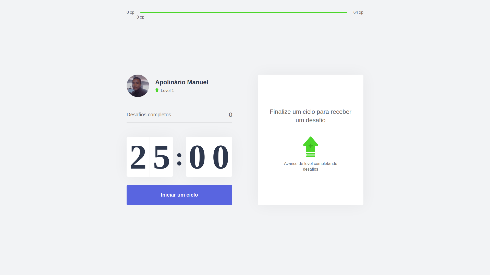

<h1 align="center">
  🚀 MOVEIT - Nunca Pare de Exercitar
</h1>

Esse projeto foi desenvolvido com as seguintes tecnologias:

- [React](https://reactjs.org)
- [NextJS](https://nextjs.org)

  

## 💻 Projeto

O MOVEIT é um projeto que tem como objectivo ajudar pessoas que ficam durante muito tempo grudados 
na tela do computador a manterem uma rotina mais saudável com pequenas paragens para exercitar as vistas, coluna etc... 
E assim estarem menos propensos a contrairem doenças.  

## Instalação 

Para executar esse repositório baixe-o para sua maquina ou faça um `Git Clone`

### Frontend | Web

- abra o projecto na Shell (No windows Power Shell em modo administrador). 
- `$ npm install` esse comando ira instalar todos os módulos necessários ao React
-  `$ npm dev` Ira iniciar o servidor na porta `localhost:3000\` 

Feito com ♥ by Apolinário Manuel
